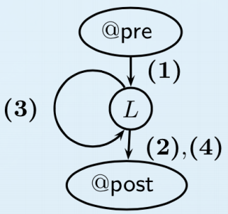

### Question 5
#### Part A
CODE:

~~~~ {#pycode .cs .numberLines }
// http://rise4fun.com/Dafny/Is4L
// return the index of an integer -- key in an integer array -- a
// if the key is not found then return -1

method FindWithLoops(a: array<int>, key: int) returns (i: int)
requires a != null;
ensures i >= 0 <==> 0 <= i <= a.Length - 1 && a[i] == key;
{
  i := a.Length - 1;
  while i >= 0
    invariant forall j :: a.Length  - 1 > j > i >= 0 ==> a[j] != key;
  {
    if a[i] == key { return; }
    i := i - 1;
  }
}
~~~~

PROOF:
\begin{equation}
 I= \forall j, a.\text{Length} - 1> j > i \geq 0 \implies a[j] != \text{key}
\end{equation}
At the beginning of the loop there is no possible $j$ so the invariant holds.

During the loop if there exists $j>i$ such that $a[j] = \text{key} $ then there must have been an $i^(\text{th})$ iteration of the loop where $a[i] = \text{key}$ and therefore the fucntion would have returned at line 18 which is a contradiction.

At the termination of the loop there are two cases $$ \exists i, a.\text{Length} - 1 > i \geq 0 \wedge a[i] = \text{key} $$
where the key was found or,  $$i = - 1 \implies \not \exists i, a.\text{Length} - 1 > i \geq 0 \wedge a[i] = \text{key}$$ in which cases the invariant also holds since it implies
$$ \forall j, a.\text{Length} - 1 > j > i = -1, \not \exists a[j] = \text{key}$$
which is equivalent to the invariant. 

Therefore the invariant holds before during and after the loop.

#### Part B

Path (1) goes from the precondition to the loop invariant
$$ @pre\ a != \text{null}; $$
$$ i := a.\text{Length} - 1; $$
$$ @L\ \forall j :: a.\text{Length}  - 1 > j > i \geq 0 \implies a[j] \neq \text{key}; $$
Path (2) goes from the loop invariant to the postcondition
$$ @L\ \forall j :: a.\text{Length}  - 1 > j > i \geq 0 \implies a[j] \neq \text{key}; $$
$$ \text{assume}\ a[i] = \text{key} $$
$$ @post\ i \geq 0 \iff 0 \leq i \leq a.\text{Length} - 1 \wedge a[i] == \text{key}; $$
Path (3) goes once through the loop
$$ @L\ \forall j :: a.\text{Length}  - 1 > j > i \geq 0 \implies a[j] \neq \text{key};  $$
$$ \text{assume} a[i] \not = \text{key}; $$
$$ i := i - 1; $$
$$ @L\ \forall j :: a.\text{Length}  - 1 > j > i \geq 0 \implies a[j] \neq \text{key}; $$
Path (4) goes from the loop invatiant to the postcondition
$$ @L\ \forall j :: a.\text{Length}  - 1 > j > i \geq 0 \implies a[j] \neq \text{key}; $$
$$ \text{assume}\ i < 0; $$
$$ @post\ i \geq 0 \iff 0 \leq i \leq a.\text{Length} - 1 \wedge a[i] = \text{key}; $$